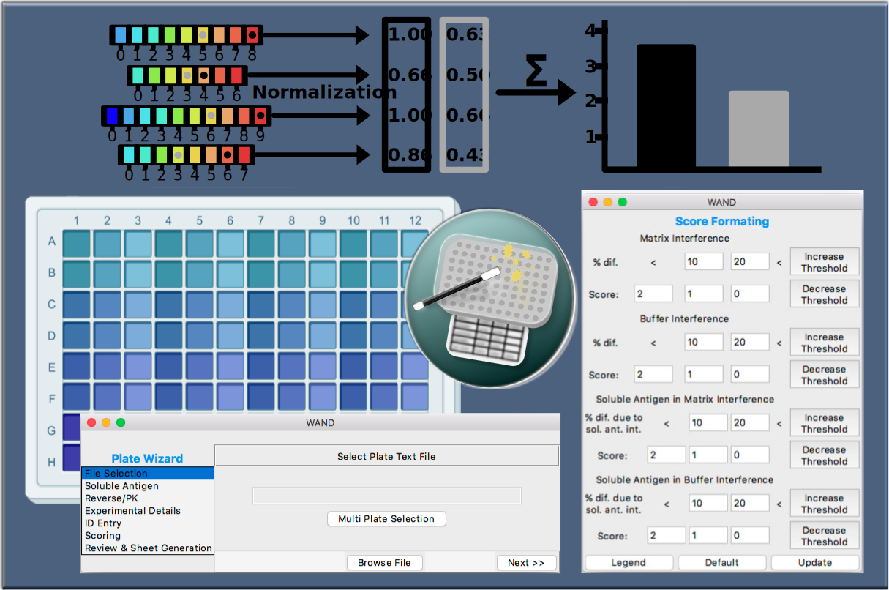

# Automated Bioanalytical Workflow for Ligand Binding Based Pharmacokinetic Assay Development

Repo containing Gaussian mixture model (GMM) based assay scoring and Workflow Automation for Nested Decisions (WAND).  Python scripts for the GMM scoring with result ploting and WAND are in seperate directories.

